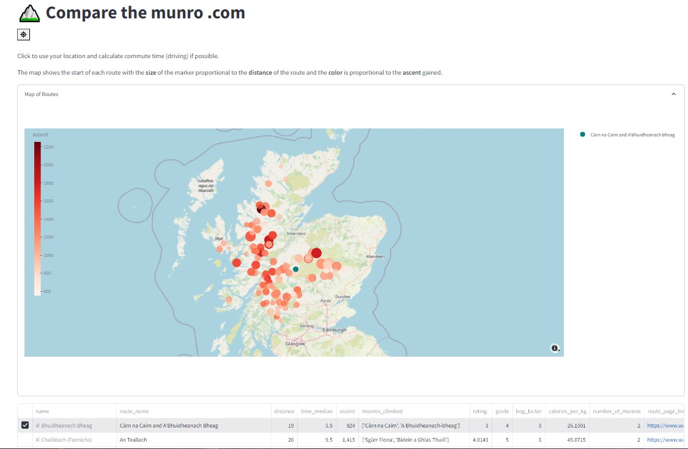
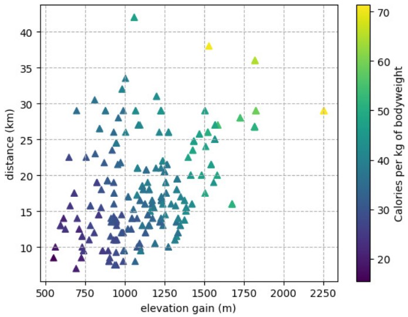

+++
title = '🏔 Compare the munro .com'
date = 2024-09-27T12:00:00+00:00
+++



### Overview

A website for the **comparison of munro routes** in Scotland. 

Features include:
- Map of all routes
- Sortable table of all routes with details + links to [Walk Highlands](https://walkhighlands.co.uk/)
- Calculation of commute time from _current location_
- Estimation of calories burned for route comparison

Links:
- [Source code](https://github.com/lewisharvey96/compare-the-munro-dotcom)
- [Hosted app](https://compare-the-munro-dotcom.streamlit.app/)


### Further Reading
#### Data
1. Data scraped from various online sources using python libraries such as `requests` and `beautifulsoup4`
2. Data cleaned and processed using `pandas`

#### Calories Burned
Used a simple empirical formula for calories burned "hiking" over some time + physics based correction
to account for elevation gain.

```
calories_burned_over_time = MET * weight * time # empirical formula
```
_where we assume metabolic equivalent task (MET) ~ 3 for 'hiking'._
```
calories_burned_over_elevation = (weight * g * elevation_gain) / (eff * joules_per_kcalorie) # physics based correction
```
_where g is acceleration due to gravity ~9.8m/s^2, eff is the efficiency of the human body ~20% 
and joules_per_kcalorie ~ 4184J_
```
calories_burned = calories_burned_over_time + calories_burned_over_elevation
```

We can see that calories burned is proportional to both elevation gain and distance of the route.


#### Commute Time
Used the `googlemaps` python library to calculate commute time (driving) from the users _current location_ to the start
of the route.

This uses Google's [Distance Matrix API](https://developers.google.com/maps/documentation/distance-matrix/overview).
