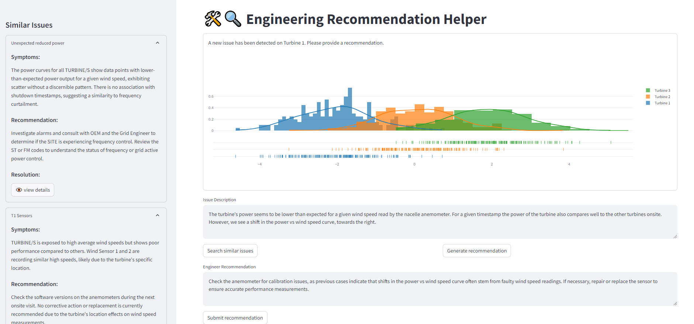

+++
title = '2024 Databricks Generative AI World Cup'
date = 2025-03-28T00:00:00+00:00
+++

As part of the Renewable Energy Systems Ltd Data Science team, I competed in the [2024 Databricks Generative AI World Cup](https://hackathon.stackup.dev/web/events/generative-ai-world-cup-2024-so-you-think-you-can-hack) and placed 3rd in the EMEA region.

The goal of this competition was to build an Generative AI solution using Databricks.

## Our Problem
We have lots of valuable textual data from engineers which detail past issues and resolutions. However, these are hard to search through and takes a lot of time to reading all relevant issues. 

What if we could search for *semantically similar issues* and use these to suggest a resolution for a new issue described by the engineer?

## The Solution - Engineering Reccomendation Generator

We created a RAG system that uses vector search to show users similar engineering issues that have occurred in the past and uses these as context to suggest how to solve a new issue. 

A streamlit UI is used to interact with the search engine.

## Example Usage
### Question
"The turbine's power seems to be lower than expected for a given wind speed read by the nacelle anemometer. For a given timestamp the power of the turbine also compares well to the other turbines onsite. However, we see a shift in the power vs wind speed curve, towards the right.

### Answer
"Check the anemometer for calibration issues, as previous cases indicate that shifts in the power vs wind speed curve often stem from faulty wind speed readings. If necessary, repair or replace the sensor to ensure accurate performance measurements."

#### *How did it do?*
This answer is *exactly* the same conclusion an engineer would make in this situation! Calibration issues with nacelle anemometery are very common and would manifest this way in the data. The model correctly identifies that since the turbines power compares well with the others on site that the most likely fault is with the anemometer itself. The UI pulls up relevant past issues in the sidebar so the engineer has all the context the model used to generate it's response.

## References
Source code for submission is [here](https://github.com/res-ds/eng-rec-search).