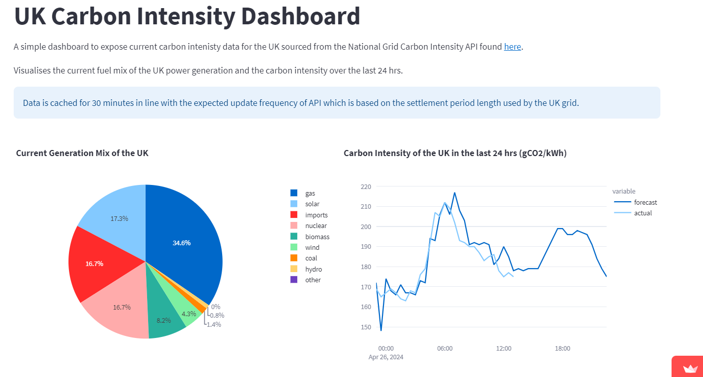

+++
title = 'Streamlit Hackathon'
date = 2024-04-26T16:20:53+01:00
draft = true
+++

Created a data app to show current UK grid carbon intensity as part of a [Streamlit](https://streamlit.io/) hackathon.

- [Source code](https://github.com/lharvey96/uk-carbon-intensity/tree/main)
- [Hosted app](https://uk-carbon-intensity.streamlit.app/)

