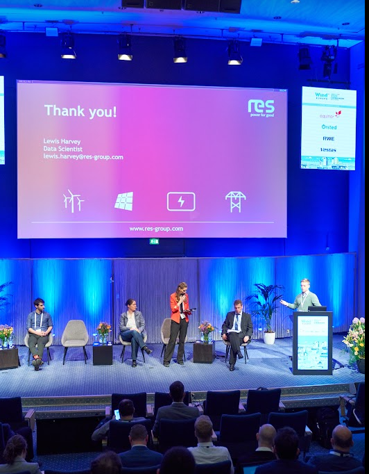
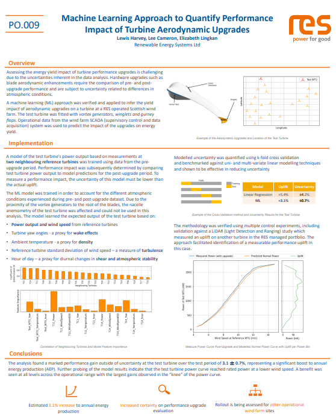

+++
title = 'Presenting at Wind Europe 2023'
date = 2024-04-26T14:42:52+01:00
+++

Presented on the topic of a machine learning application within the wind industry at the annual WindEurope conference in Copenhagen on behalf of RES. Machine learning was used to validate the performance impact of turbine aerodynamic upgrades.

